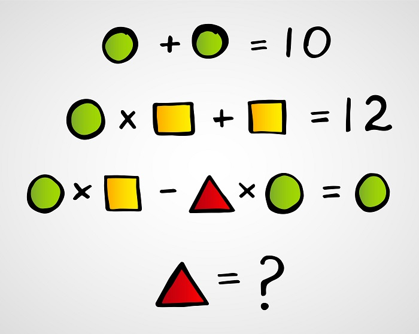

# Exercise Z3

- [ ] Follow the [Z3 Playground](https://jfmc.github.io/z3-play/) up to Bitvectors (don't read Bitvectors).

> :warning: Some browsers might not run the playground properly. Safari is a browser we know doesn't work well. Chrome, Chromium, Firefox, and Brave browsers have been tested to work fine.

- [x] Use Z3 to find a solution for the following puzzle:
</br>


```z3
(declare-const x Int)
(declare-const y Int)
(declare-const z Int)
(assert (= (+ x x) 10))
(assert (= (+ y (* x y)) 12))
(assert (= (- (* x y) (* x z)) x))
(check-sat)
(get-model)
---
sat
(
  (define-fun x () Int
    5)
  (define-fun z () Int
    1)
  (define-fun y () Int
    2)
)

```

- [x] Write a formula to check if the following two equations are equivalent:
</br>


```z3
(declare-const p Bool)
(declare-const q Bool)

(define-fun conjecture () Bool
	(= (= (and p q) p)
		(=> p q)))
(assert (not conjecture))
(check-sat)
```

- [ ] A good additional practice will be to try and prove questions in [this file](AdditionalExerciseForSMT.pdf)

> :information_source: You might find the [cheat sheet](Cheat_Sheet.md) useful for the exercises and additional explanations of the Z3 principles.
